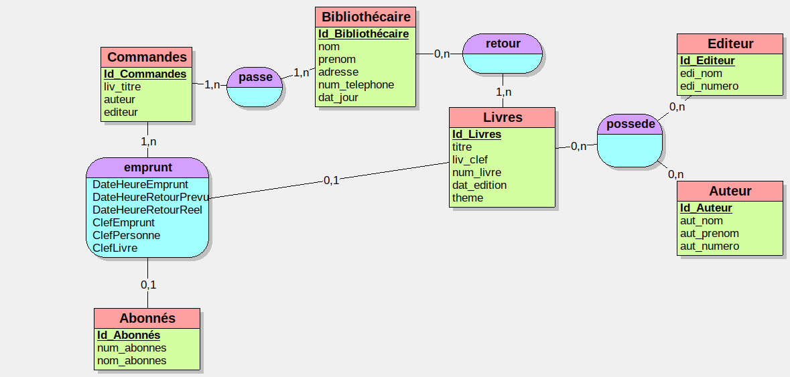

# Exercice 1 : Domaine de Gestion des emprunts



## Script :
```SQL
CREATE Bibliothèque;

USE Bibliothèque; 

CREATE TABLE Commandes(
   Id_Commandes COUNTER,
   liv_titre VARCHAR(50),
   auteur VARCHAR(50),
   editeur VARCHAR(50),
   PRIMARY KEY(Id_Commandes)
);

CREATE TABLE Bibliothécaire(
   Id_Bibliothécaire COUNTER,
   nom VARCHAR(50),
   prenom VARCHAR(50),
   adresse VARCHAR(50),
   num_telephone VARCHAR(50),
   dat_jour VARCHAR(50),
   PRIMARY KEY(Id_Bibliothécaire)
);

CREATE TABLE Livres(
   Id_Livres COUNTER,
   titre VARCHAR(50),
   liv_clef VARCHAR(5000),
   num_livre VARCHAR(5000),
   dat_edition DATE,
   theme VARCHAR(20),
   PRIMARY KEY(Id_Livres)
);

CREATE TABLE Editeur(
   Id_Editeur COUNTER,
   edi_nom VARCHAR(50),
   edi_numero VARCHAR(50),
   PRIMARY KEY(Id_Editeur)
);

CREATE TABLE Auteur(
   Id_Auteur COUNTER,
   aut_nom VARCHAR(50),
   aut_prenom VARCHAR(50),
   aut_numero VARCHAR(50),
   PRIMARY KEY(Id_Auteur)
);

CREATE TABLE Abonnés(
   Id_Abonnés COUNTER,
   num_abonnes VARCHAR(1000),
   nom_abonnes VARCHAR(50),
   PRIMARY KEY(Id_Abonnés)
);

CREATE TABLE retour(
   Id_Bibliothécaire INT,
   Id_Livres INT,
   PRIMARY KEY(Id_Bibliothécaire, Id_Livres),
   FOREIGN KEY(Id_Bibliothécaire) REFERENCES Bibliothécaire(Id_Bibliothécaire),
   FOREIGN KEY(Id_Livres) REFERENCES Livres(Id_Livres)
);

CREATE TABLE emprunt(
   Id_Abonnés INT,
   DateHeureEmprunt DATE,
   DateHeureRetourPrevu DATE,
   DateHeureRetourReel DATE,
   ClefEmprunt VARCHAR(50),
   ClefPersonne VARCHAR(50),
   ClefLivre VARCHAR(50),
   Id_Livres INT NOT NULL,
   Id_Commandes INT NOT NULL,
   PRIMARY KEY(Id_Abonnés),
   UNIQUE(Id_Livres),
   FOREIGN KEY(Id_Abonnés) REFERENCES Abonnés(Id_Abonnés),
   FOREIGN KEY(Id_Livres) REFERENCES Livres(Id_Livres),
   FOREIGN KEY(Id_Commandes) REFERENCES Commandes(Id_Commandes)
);

CREATE TABLE possede(
   Id_Livres INT,
   Id_Editeur INT,
   Id_Auteur INT,
   PRIMARY KEY(Id_Livres, Id_Editeur, Id_Auteur),
   FOREIGN KEY(Id_Livres) REFERENCES Livres(Id_Livres),
   FOREIGN KEY(Id_Editeur) REFERENCES Editeur(Id_Editeur),
   FOREIGN KEY(Id_Auteur) REFERENCES Auteur(Id_Auteur)
);

CREATE TABLE passe(
   Id_Commandes INT,
   Id_Bibliothécaire INT,
   PRIMARY KEY(Id_Commandes, Id_Bibliothécaire),
   FOREIGN KEY(Id_Commandes) REFERENCES Commandes(Id_Commandes),
   FOREIGN KEY(Id_Bibliothécaire) REFERENCES Bibliothécaire(Id_Bibliothécaire)
);
```